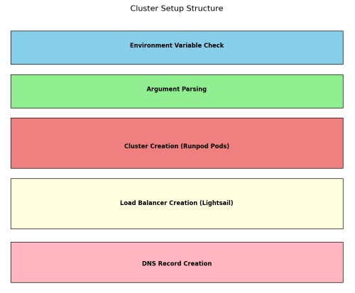

# RunPod Cluster

This is a simple script to create a RunPod cluster with a Caddy loadbalancer and DNS records.

The DNS records and the Caddy automatic https depends on using a Cloudflare account.

The current version simply uses the default pricing for RunPod pods.

## Script Structure

## Pricing

The setup will cost around $0.3 per GPU per hour for RunPod and minimum $5 per month for the Caddy loadbalancer.

Additional, pricing can be found here: 
* https://www.runpod.io/gpu-instance/pricing
* https://aws.amazon.com/lightsail/pricing/

## Requirements

### Software
* direnv
* python
* runpodctl

### Resources
* RunPod API key
* Cloudflare Token
* AWS API key with access to Lightsail

## Steps

1. Setup the environment variables inside the .envrc file. You can use the .envrc.example as a template. Refer to the Notes section for more information.

2. Run `direnv allow .` to load the environment variables.

3. Run `python app.py` to create the cluster. You can also refer to Makefile.
   1. The RunPod cluster will be created according to the variables in the .envrc file and a Caddyfile will be created.
   2. The Caddy loadbalancer will be created using the Caddyfile.
   3. The DNS records will be created to point to the loadbalancer. 

Done.

## Notes

1. You can remove the cluster by running `python remove.py`.

2. If you want to skip steps of the cluster creation, you can use the `--skip-runpod`, `--skip-loadbalancer`, `--skip-dns` to skip the respective steps. You can also use the same flags in the remove.py script.

### Environment Variables

#### AWS Configuration
* **AWS_ACCESS_KEY_ID**: This is the Access Key ID for your Amazon Web Services (AWS) account. It's used for authentication when accessing AWS services.
* **AWS_SECRET_ACCESS_KEY**: This is the Secret Access Key corresponding to the above Access Key ID. It's also used for authentication when accessing AWS services.
* **LIGHTSAIL_INSTANCE_NAME**: The name assigned to the AWS Lightsail instance. You should set this to a unique name that you can easily identify in the dashboard.
* **LIGHTSAIL_INSTANCE_REGION**: The AWS region in which the Lightsail instance is located. The default is set to the Tokyo region (ap-northeast-1a).
* **LIGHTSAIL_INSTANCE_BUNDLE_ID**: The bundle ID representing the Lightsail instance plan.
  * Here is a list of available bundles: 
      | Bundle        | Price (USD) | RAM (GB) | vCPUs | Disk (GB) | Transfer (TB) |
      |---------------|-------------|----------|-------|-----------|--------------|
      | nano_3_0      | $3.50       | 0.5      | 2     | 20 SSD    | 1            |
      | micro_3_0     | $5          | 1        | 2     | 40 SSD    | 2            |
      | small_3_0     | $10         | 2        | 2     | 60 SSD    | 3            |
      | medium_3_0    | $20         | 4        | 2     | 80 SSD    | 4            |
      | large_3_0     | $40         | 8        | 2     | 160 SSD   | 5            |
      | xlarge_3_0    | $80         | 16       | 4     | 320 SSD   | 6            |
      | 2xlarge_3_0   | $160        | 32       | 8     | 640 SSD   | 7            |

#### Cloudflare Configuration
* **CLOUDFLARE_API_KEY**: Your Cloudflare API key, used to make authenticated requests to the Cloudflare API.
* **CLOUDFLARE_ZONE_ID**: The ID representing your domain in Cloudflare. It's required when making requests related to a specific domain on Cloudflare.
* **CADDY_DOMAIN**: The domain name to be used with the Caddy server (e.g., example.com).
* **CLOUDFLARE_EMAIL**: The email address associated with your Cloudflare account. It is required for automatic https by Caddy.

#### RunPod Configuration
* **RUNPOD_API_KEY**: The API key used to authenticate with the RunPod service.
* **RUNPOD_CREATION_RETRIES**: The number of times the system should retry the creation of a RunPod if it fails. The default is 3.
* **RUNPOD_GPU_TYPE**: The GPU for the RunPod pods. Default is NVIDIA GeForce RTX 3090.
* **RUNPOD_IMAGE_NAME**: The Docker image name to be used for the RunPod pods. Here, it's set to runpod/stable-diffusion:web-ui-10.1.0.
* **RUNPOD_POD_NAME**: A name identifier for the RunPod pods. Used to identify them for deletion.
* **RUNPOD_POD_COUNT**: The number of pods to be started. Default is 2.
* **RUNPOD_POD_START_RETRIES**: The number of times to ping a pod to check if it's running.
* **RUNPOD_POD_START_RETRY_DELAY**: The delay (in seconds) between retries when pinging a pod. 